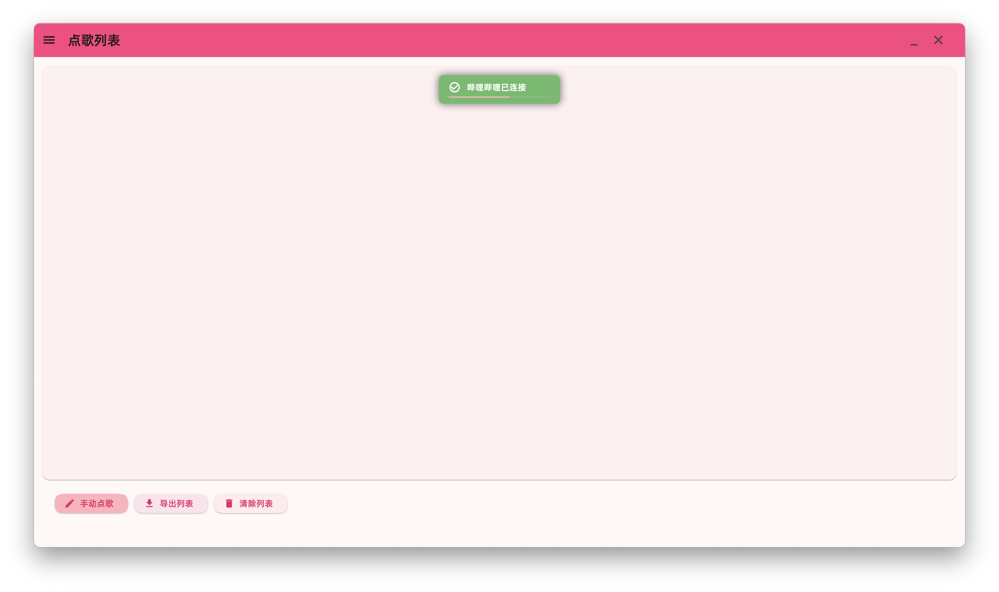
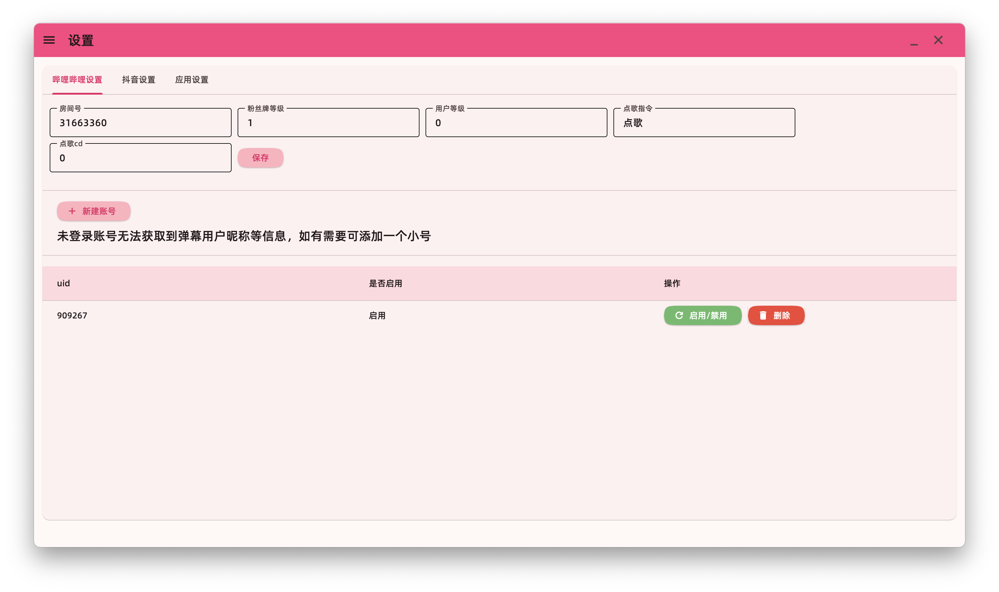
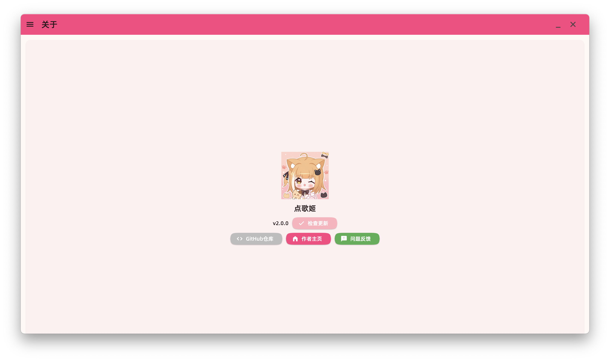
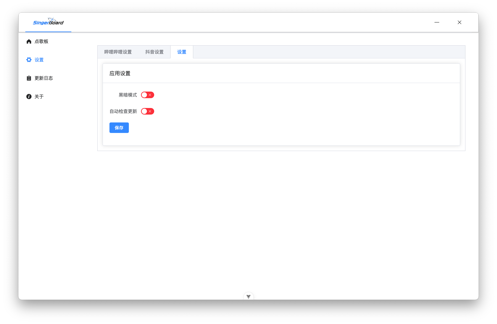
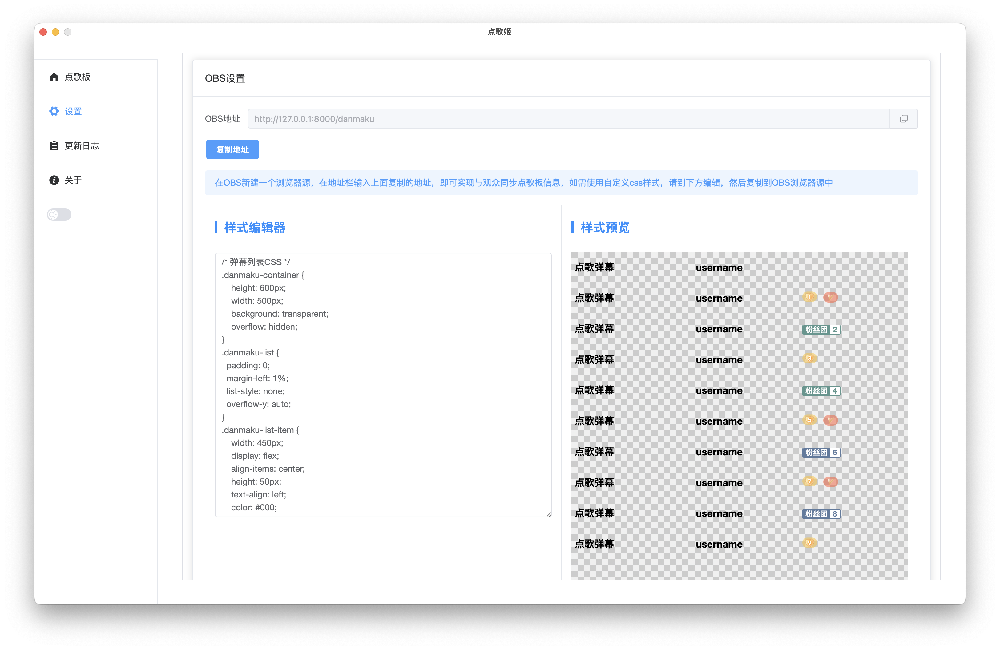

<div align="center">
  
  <br>
</div>

<div align="center">

# VSingerBoard - 您的专属虚拟主播点歌台

  

</div>

---

> 在弹幕的海洋中，手动记录点歌请求不仅繁琐，还容易错失粉丝的热情。VSingerBoard 专为解决这一痛点而生，它是一座连接主播与粉丝的桥梁，一个为虚拟主播、歌手和音乐爱好者打造的跨平台智能点歌管理面板。
> 
> **VSingerBoard** 将混乱的弹幕点歌请求，转化为一个优雅、有序、可交互的列表，让您能专注于表演，而非手忙脚乱的管理。

## ✨ 核心功能

- 🎤 **多平台支持**: 已无缝支持 **Bilibili** 和 **抖音** 两大主流直播平台，并具备良好的扩展性。
- 🚀 **实时弹幕抓取**: 基于高性能异步框架，实时捕获并智能过滤点歌弹幕，确保不会错失粉丝的热情互动。
- 🛡️ **高稳定连接**: 针对抖音平台，通过模拟浏览器签名算法和原生 WebSocket 通信，实现长期、稳定的弹幕连接。
- 🎨 **现代化UI界面**: 采用 Vue 3 和 Element Plus 构建，界面简洁美观，支持亮色/暗色模式一键切换，提供卓越的操作体验。
- 🛠️ **自动化构建与部署**: 借助 GitHub Actions 实现全自动的跨平台（Windows, macOS, Linux）打包与发布，确保您随时能获取最新的稳定版本。
- 🔒 **本地化数据存储**: 使用 Tortoise-ORM 配合 SQLite，将所有配置和凭据安全存储在本地，杜绝隐私泄露风险。

## 📸 应用截图







## 🚀 如何使用

对于普通用户，我们强烈建议您直接下载已打包好的应用程序。

1.  前往 [**GitHub Releases**](https://github.com/zangxx66/VSingerBoard/releases) 页面。
2.  根据您的操作系统（Windows, macOS, 或 Linux），下载最新版本的压缩包。
3.  解压后，直接运行主程序即可！

## 🛠️ 技术栈

- **后端**: Python 3.12, FastAPI, Uvicorn, Tortoise-ORM
- **前端**: Vue 3, Vite, Element Plus, TypeScript
- **桌面端框架**: Pywebview
- **直播平台接口**: `bilibili-api-python`, `websocket-client`, `py_mini_racer`, `Protobuf`
- **构建与打包**: PyInstaller, GitHub Actions

## 🤝 如何贡献

我们欢迎任何形式的贡献！无论是提交 Bug、建议新功能，还是直接贡献代码，都将是对本项目的巨大支持。

推荐使用 **VS Code** 作为开发IDE。环境要求：**Python 3.12+** 和 **Node.js**。

1.  **Fork** 本仓库。
2.  创建您的新分支 (`git checkout -b feature/AmazingFeature`)。
3.  **安装依赖:**
    - **后端:**
      ```bash
      pip install uv && uv sync
      ```
      > **⚠️ Linux 用户请注意:**
      > 如果您使用 Linux 系统，请额外安装 GTK 和 WebKit 的开发库：
      > `sudo apt-get install -y python3-gi python3-gi-cairo gir1.2-gtk-3.0 gir1.2-webkit2-4.1`

    - **前端:**
      ```bash
      cd frontend
      npm install
      ```
4.  **运行与开发:**
    启动开发环境：
    ```bash
    uv run main.py
    ```
    > 该命令将同时启动后端的 FastAPI 服务与前端的 Vite 开发服务器。代码修改后，应用会自动热重载。
5.  **提交您的更改** (`git commit -m 'feat: Add some AmazingFeature'`)。
6.  **推送您的分支** (`git push origin feature/AmazingFeature`)。
7.  **创建 Pull Request**。

## ❤️ 致谢

本项目的实现离不开以下优秀开源项目的支持：

- [bilibili-api](https://github.com/Nemo2011/bilibili-api)
- [DouyinLiveWebFetcher](https://github.com/saermart/DouyinLiveWebFetcher)
- [PyWebview](https://github.com/r0x0r/pywebview)

## 📄 许可证

本项目基于 GPL-3.0 许可证发布。详情请见 `LICENSE` 文件。