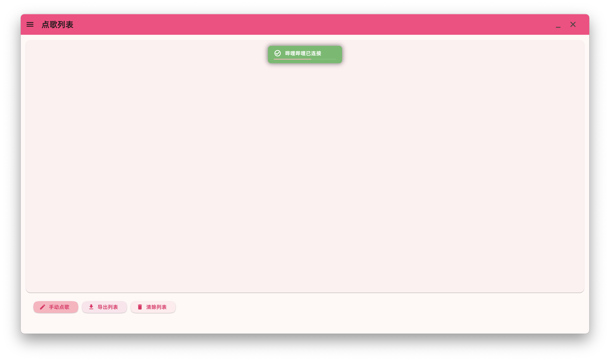
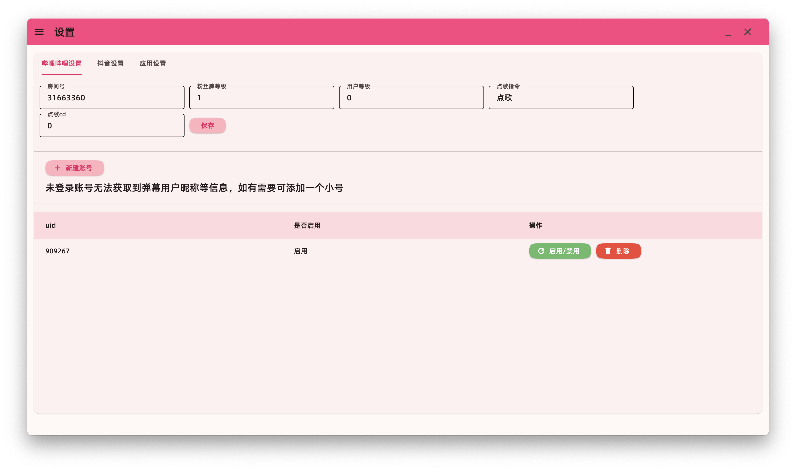
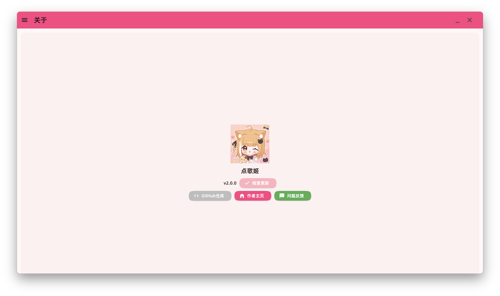

<div align="center">
  
  <br>
</div>

<div align="center">

# VSingerBoard - 您的专属虚拟主播点歌台

  

</div>

---

> **VSingerBoard** 是一款专为虚拟主播、歌手和音乐爱好者打造的跨平台智能点歌管理面板。它能将直播间混乱的点歌弹幕转化为一个优雅、有序、可交互的列表，让您专注于直播，而非手忙脚乱地记录。

## ✨ 核心功能

- 🎤 **多平台支持**: 无缝支持 **Bilibili** 和 **抖音** 两大主流直播平台。
- 🚀 **实时弹幕抓取**: 基于异步 I/O 框架，实时捕获并智能识别点歌请求，确保不遗漏每一份热情。
- 🛡️ **高稳定连接**: 针对抖音平台，集成签名算法和 WebSocket 原生通信，配合后台异步任务，实现长期、稳定的弹幕监听。
- 🎨 **现代化 UI 界面**: 基于 **Flet (Flutter for Python)** 构建，采用 Material Design 风格，界面精美且支持跨平台原生体验。
- 📊 **歌单与历史管理**: 内置数据库，支持导入本地歌单，自动记录点歌历史，方便复盘和管理。
- 🔒 **本地化存储**: 使用 Tortoise-ORM 配合 SQLite，所有配置和凭据均存储在本地，安全可控。

## 📸 应用截图





## 🛠️ 技术栈

- **UI 框架**: [Flet](https://flet.dev/) (Flutter for Python)
- **核心语言**: Python 3.12+
- **数据库**: Tortoise-ORM, Aerich (迁移管理)
- **网络与通信**: `aiohttp`, `curl-cffi`, `betterproto2` (Protobuf)
- **直播接口**: `bilibili-api-python`, 抖音自定义 WebSocket 客户端
- **打包工具**: PyInstaller (通过 `flet pack`)

## 📂 项目结构

```
.
├── assets/                   # 静态资源 (图标、字体、JS 签名库等)
├── doc/                      # 项目文档与截图
├── hooks/                    # PyInstaller 打包与运行时钩子
├── src/                      # 核心源码
│   ├── database/             # 数据模型与 Tortoise-ORM 封装
│   ├── douyin/               # 抖音协议适配、签名逻辑与 Protobuf 定义
│   ├── live/                 # 直播平台 (Bilibili/抖音) 适配器实现
│   ├── manager/              # 服务器、消息订阅与生命周期管理器
│   ├── notifypy/             # 跨平台桌面通知封装库
│   ├── ui/                   # Flet UI 组件与页面
│   │   ├── components/       # 业务相关 UI 组件 (如平台 Tab)
│   │   ├── controls/         # 通用自定义控件 (分页、进度条、Toast)
│   │   └── pages/            # 各功能模块路由页面
│   └── utils/                # 工具函数 (日志、异步工作流、WebSocket 封装)
├── tests/                    # 单元测试与集成测试
├── main.py                   # 应用启动入口
├── pack.sh                   # 多平台打包构建脚本
├── pyproject.toml            # uv 项目配置与依赖管理
└── VSingerBoard.spec         # PyInstaller 打包配置文件
```

## 🤝 开发与贡献

本项目推荐使用 [**uv**](https://docs.astral.sh/uv/) 进行包管理，推荐使用 **VS Code** 作为开发 IDE。

1.  **克隆项目**:
    ```bash
    git clone https://github.com/zangxx66/VSingerBoard.git
    cd VSingerBoard
    ```

2.  **安装依赖**:
    ```bash
    uv sync
    ```

3.  **运行应用**:
    ```bash
    uv run flet run main.py
    ```

4.  **本地构建 (打包)**:
    ```bash
    bash pack.sh
    ```

## ❤️ 致谢

本项目的实现离不开以下优秀开源项目的支持：
- [Flet](https://flet.dev/)
- [bilibili-api](https://github.com/Nemo2011/bilibili-api)
- [Tortoise-ORM](https://tortoise.github.io/)

## 📄 许可证

本项目基于 GPL-3.0 许可证发布。详情请见 `LICENSE` 文件。
