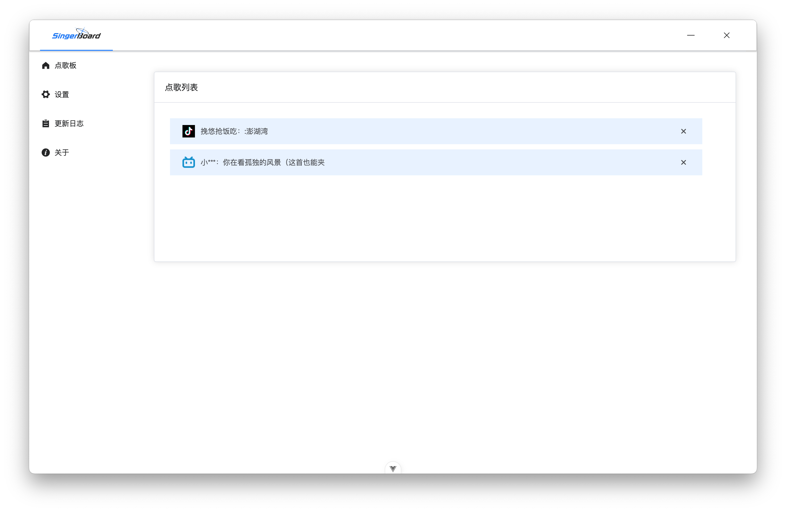
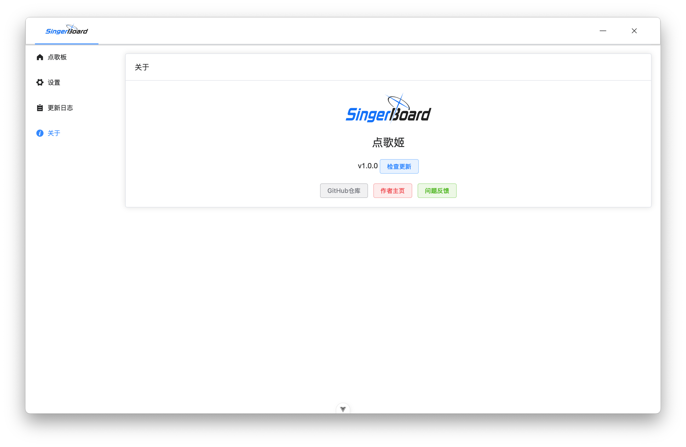

# 点歌姬使用文档  

- [点歌姬使用文档](#-------)
  * [主界面](#主界面)
  * [设置](#设置)
    + [哔哩哔哩设置](#哔哩哔哩设置)
    + [抖音设置](#抖音设置)
    + [应用设置](#应用设置)
    + [OBS设置（可选）](#obs设置可选)
  * [问题反馈](#问题反馈)

## 主界面

- 侧边栏：左边是应用菜单，依次是”点歌板（即点歌列表）“，”设置“，”更新日志“和”关于“
- 点歌板：  

    1. 右边是点歌列表，当观众发送点歌命令后，这里会以列表形式展示点歌信息，点击可复制歌名  
    2. 下方有三个按钮，依次是”手动点歌“，”清空列表“和”导出列表“，当某些不可抗力因素无法正常点歌时，主播可使用手动点歌的方式添加到点歌列表中，点歌信息太多时可使用一键清空列表，当需要保存点歌信息时可使用导出点歌列表功能，右边展示的图标和数字为已设置的对应平台的房间号，旁边的图标为连接状态，当连接状态异常时可点击图标手动重连

## 设置  

### 哔哩哔哩设置  

哔哩哔哩设置分为”基础设置“和”账号设置“  

- 基础设置：  

    1. 房间号：你的直播间房间号  

    2. 点歌CD：点歌的CD时长，单位为秒，0则不限制时长  

- 账号设置：  
    由于哔哩哔哩的限制，未登录用户无法获取到弹幕发送者的昵称等信息，如有需要可添加一个小号  
    1. 点击新增按钮扫码登录添加账号，所有的登录凭证都将保存在本地，不会上传到任何第三方服务器  

    2. 新增账号默认”未启用“状态，点击”启用“后将使用登录凭证重新连接已设置的哔哩哔哩直播间，之后的点歌信息会带上完整的用户昵称  

    3. 凭证信息存在有效性，可手动点击”刷新凭证“按钮刷新有效期，不建议频繁刷新凭证防止触发风控等不可预知的风险

  

### 抖音设置  

抖音的限制较少，只需设置对应的直播间房间号等信息即可，这里的点歌cd也是以秒为单位，0则不限制

  

###  应用设置  

- 主题风格（亮色/暗色模式）  

- 桌面通知：当收到新的点歌信息，以系统消息的方式发送通知  

 

###  OBS设置（可选）  

OBS添加点歌板到直播间方法  

1. OBS添加一个浏览器源  

2. 复制地址到OBS的浏览器源  

3. 在样式编辑器修改默认样式，右边的样式预览实时更新更改后的效果，将修改后的样式复制到OBS浏览器源"自定义CSS”中

 

##  问题反馈  

在使用过程中遇到任何问题或bug，可在 [**issue**](https://github.com/zangxx66/VSingerBoard/issues) 提交，建议在提交新的issue前搜索关键词是否已存在类似问题，这样可快速找到解决方案